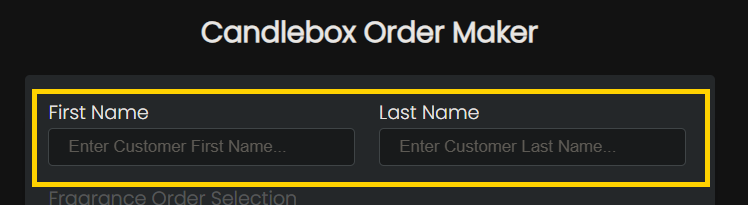
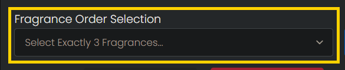
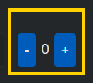
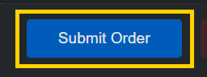
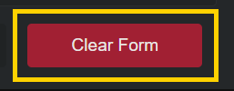
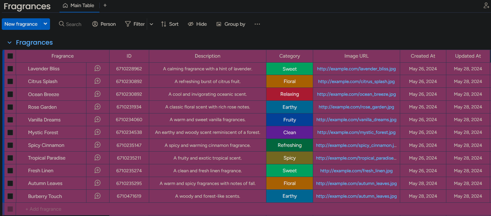
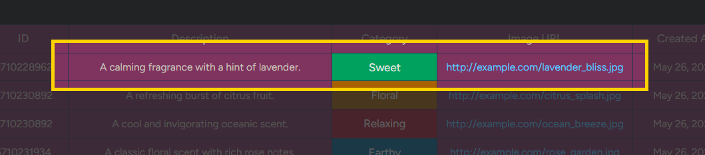
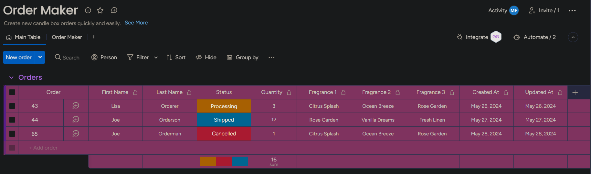
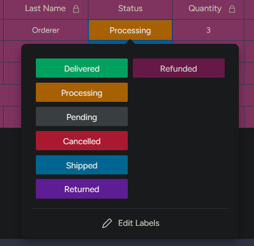

<p align="center">
   
</p>

This client application provides an interface for managing candle orders, specifically integrated with the Monday.com platform. It allows users to place orders, manage fragrance offerings, and interact with the Monday.com boards to achieve this functionality. This repo is one of three for this application; the API can be found <a href="https://github.com/mfiloramo/mondayProjectAPI">here</a>, and the T-SQL Tables and Stored Procedures can be found <a href="https://github.com/mfiloramo/mondayProjectSQL">here</a>.

<hr>

## Table of Contents

- [Installation](#installation)
- [Usage](#usage)
- [Interacting with the Application](#interacting-with-the-application)
- [Tech Stack](#tech-stack)

## Installation

To set up the project locally, follow these steps:

1. **Clone the repository**:
    ```bash
    git clone https://github.com/mfiloramo/mondayProject.git
    cd mondayProject
    ```

2. **Install dependencies**:
    ```bash
    npm install
    ```

## Usage

The client application allows users to place candle orders, select fragrances, and interact with the Monday.com platform. To run the application locally, use the following command:

```bash
npm run dev
```

This will start the application in development mode on the specified  using the `next dev server`.

To run the application in development using <a href="https://turbo.build/pack">Turbopack</a>, an experimental Rust-powered incremental build tool available within Next.js, run the following command:

```bash
npm run turbo
```

This will leverage Turbopack to run the development server. Changes in development will now be incremental, so you can enjoy significantly streamlined development in your browser. Note that this tool is in beta and currently does not yet support build outputs.

## Interacting with the Application

The application consists of several key components:

### Order Maker

1. **Input Customer Details**:
    - Enter the customer's first name and last name.
    - <p align="center"></p>

2. **Select Fragrances**:
    - Use the dropdown to select exactly 3 fragrances for the order.
    - <p align="center"></p>

3. **Specify Quantity**:
    - Use the quantity selector to specify the number of kits.
    - <p align="center"></p>

4. **Submit Order**:
    - Click the "Submit Order" button to place the order.
    - <p align="center"></p>

5. **Clear Form**:
    - Use the "Clear Form" button to reset all input fields.
    - <p align="center"></p>

### Monday.com Boards

#### Fragrances Board

- **View Fragrances**:
    - Displays all available fragrances.
    - <p align="center"></p>

- **Add/Update/Delete Fragrances**:
    - Directly interact with the fragrances board to manage fragrance offerings.
    - <p align="center"></p>

#### Orders Board

- **View Orders**:
    - Displays all placed orders and their statuses.
    - <p align="center"></p>

- **Update Order Status**:
    - Change the status of an order directly on the board.
    - <p align="center"></p>

## Tech Stack

This project utilizes a modern tech stack to ensure both robustness and ease of development. Below is a brief overview of the technologies used and why they were chosen.

<table style="border-collapse: collapse; border: none;">
  <tr>
    <td style="padding: 10px;">
      <br>
      A statically typed superset of JavaScript that enhances code quality and readability. Chosen for its robust type-checking and improved developer productivity.
    </td>
    <td style="padding: 10px;">
      <br>
      A JavaScript library for building user interfaces. Chosen for its component-based architecture, simple state management, and compatibility with the Monday.com platform.
    </td>
  </tr>
  <tr>
    <td style="padding: 10px;">
      <br>
      A React framework with hybrid static & server rendering, and route pre-fetching. Chosen for its fast setup and performance optimization capabilities.
    </td>
    <td style="padding: 10px;">
      <br>
      A design system by Monday.com for building consistent and cohesive user interfaces. Chosen for seamless integration with the Monday.com platform.
    </td>
  </tr>
  <tr>
    <td style="padding: 10px;">
      <br>
      A utility-first CSS framework for rapidly building custom designs. Chosen for its flexibility and ease of use in user interface layout.
    </td>
    <td style="padding: 10px;">
      <br>
      An experimental, Rust-powered, incremental build tool for Next.js applications. Chosen for its performance and speed in application bundling during development.
    </td>
  </tr>
</table>


## Application Flow
Below is a diagram illustrating the flow of data within the client application. Data flows from the frontend to the backend API, which processes requests by firing stored procedures that interact with the database, and updates are synchronized with Monday.com via webhooks.

<p align="center">
   
</p>
<br><br>